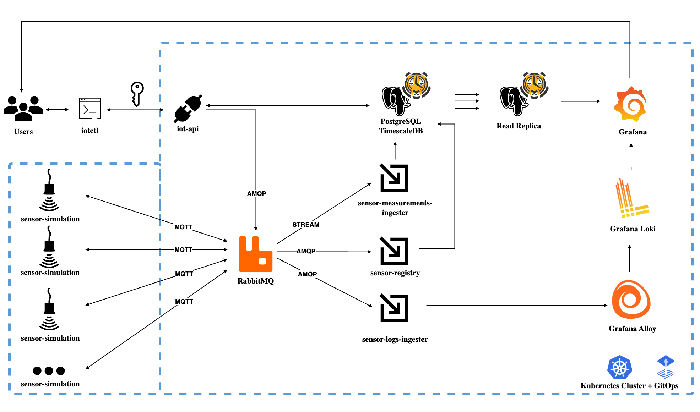

# Sensor Data Streaming PubSub

## General Description

This project implements an end-to-end real-time monitoring solution for IoT devices, designed to measure parameters like acceleration (or others such as temperature, strain, or humidity) in mechanical equipment or civil structures, with real-time geospatial tracking.


> [!NOTE]
> I think that a design like this serves as a solid starting point for a larger project involving real sensor hardware, including data and GPS transmission via Wi-Fi or GSM in both mobile vehicles and static machinery, as well as in civil infrastructure. 
> RabbitMQ is quite flexible and powerfull with its routing strategy, recenlty featured stream queues. 
> Similarly, TimescaleDB bridges a significant paradigm gap, making SQL a competitive option for time-series solutions, which were traditionally dominated by NoSQL databases. 
> The project is written in Go. Go is pretty dope.

## Reason
Back in 2020, I worked on **vibration analysis**. My main background at that time was in **Mechanical Engineering**, and I took on a role that involved designing sensor installations, performing in-field measurements, and analyzing the data back at the office. 

I measured various types of **mechanical equipment**, such as overhead cranes in a mining plant and climate control systems (including pumps, cooling towers and air handling units) at Chile’s main airport. Additionally, I assessed **civil structures**--protected, commercial, and private buildings--subjected to nearby construction or physical phenomena, such as vibrations generated by passing trains.

All of these tasks were performed **in-situ**, which motivated me to consider a more ambitious approach: **remote, real-time monitoring**. Such a system could open up **new business opportunities** by offering continuous insight without requiring on-site personnel.

With that in mind, my goal for this project is to build a comprehensive **end-to-end**, real-time monitoring solution.


## :nut_and_bolt: Architecture


The core of this solution is built around an **event-driven** architecture that utilizes a **pub/sub** pattern, enabling the creation of a **distributed system**. However, as with many systems, a **hybrid** approach is necessary. This includes employing **point-to-point** communication for interactions with the sensor cluster via a command-line tool which communicates with an API, allowing controlled interactions with both the **database** and the **message broker**.

### The services defined in the project are the following:
<dl>
  <dt><code>iotctl</code></dt>
  <dd>A command-line tool to interact remotely with a cluster of sensors.</dd>
  <dt><code>iot-api</code></dt>
  <dd>An API that facilitates communication between the service and `iotctl` users over *HTTPS*. It acts as a gateway for interacting with the database and the sensors through the message broker.</dd>
  <dt><code>sensor-simulation</code></dt>
  <dd>Simulates an accelerometer measuring a specific environment. For example, it could mimic the signal of a bearing in a pump system. It consumes commands sent from `iot-api` and publishes its logs (e.g., booting logs), the sensor's serial number for enrollment of the sensor in the database, as well as the measurement values.</dd>
  <dt><code>sensor-registry</code></dt>
  <dd>Consumes sensor enrollment information,  with a behavior like: "Look, I'm a sensor with serial number 'xxxx'. If I'm not in the database, please register me so I can start sending measurements."</dd>
  <dt><code>sensor-logs-ingester</code></dt>
  <dd>Consumes sensor logs and saves them into a .log for centralized processing later.</dd>
  <dt><code>sensor-measurements-ingester</code></dt>
  <dd>Consumes sensor measurements and inserts them into the postgres/timescaledb instance.</dd>
</dl>

> [!IMPORTANT]
> These services are dependant of other software such as the message broker, a database that would handle timeseries data with ease, a log aggregation system with an observability collector and a visualization tool to real-time monitoring.

The project is designed to be deployed using **GitOps** on a **Kubernetes** cluster within my [homelab](https://github.com/iferdel/homelab), ensuring availability and horizontal scaling. For example, to handle increased sensor sampling rates or the addition of more sensors (simulated by replicating the simulation service). While I'm **not a fan of self-hosted databases** and would prefer a full cloud solution, an exception is made here for practicality. Meanwhile, the command-line tool is designed to be installed locally by users with access to the cluster under a specific role.

<details>
<summary><strong>:mag: Key Architectural Points</strong></summary>

- **Data Transfer**: The solution is intended to use Protobuf as a data serialization format to match real scenarios with embedded C or C++. However, for the initial setup (POC), the Go encoding/gob serializer is in use to ease development.
- **Infrastructure**: This project integrates with my [homelab](https://github.com/iferdel/homelab), which simulates a cloud-like environment on bare metal using TalosOS and GitOps with FluxCD. The only service that's out from the cluster is the command line tool which is intended to be used within a remote machine that needs to authenticate in order to interact with the sensor cluster.
- **CI/CD**: For CI/CD, I’m using a private Jenkins server and Docker Hub for image storage, while the GitHub repository hosts the source code. The whole CD would be handled with FluxCD.
- **Secrets**: I’m using Azure Key Vault for secrets in the homelab. 
- **Database**: The solution uses PostgreSQL with [TimeScaleDB](https://www.timescale.com/), an extension optimized for time-series data. In a real scenario, the paid cloud tier would be in use, but for this project I’m storaging everything on bare metal.
- **Data Management**: TimeScaleDB’s policies handle data expiration and compression, preventing storage overflow and improving performance.
- **Visualization**: Grafana is used for near real-time dashboards, leveraging its querying capabilities to visualize time-series data stored as well as stats from the database itself by means of wrapping the stats from pg_stat_statements and pg_stat_kcache with postgres CTEs and procedures. Last by not least, to query logs (e.g. sensor boot logs) from sources like Loki.
- **Alarms**: *...*  
- **Communication Protocols**:
    - *Sensor communication uses MQTT with streaming queues.*
    - *Inter-service communication uses AMQP with RabbitMQ, employing quorum queues.*
    - *Alarm service communication uses gRPC for low-latency communication with the machine where the sensor to affect behaviour*

*Disclaimer: one could conclude that a hybrid architecture for critical low-latency control would also be quite handy. In that case, one would expect using gRPC as the way to communicate between a service that would send direct commands to change behaviour (in a reactive way) not the sensor but to the machine or whatever is behind.*

</details>

## :art: Design 

> Just threw some paint on the canvas tonight.
>
> -- <cite><i>Kawhi Leonard</i></cite>

<details>
<summary><strong>:deciduous_tree: Directory Tree</strong></summary>

*I like the structure that became manifest while developing the project. That's why I'm attaching the filetree since it reads nicely.*
```
.
├── IDEAS.md
├── LICENSE
├── README.md
├── cmd
│   ├── iot-api
│   │   ├── Dockerfile
│   │   ├── air.toml
│   │   ├── handler_sensors_awake.go
│   │   ├── handler_sensors_freq.go
│   │   ├── handler_sensors_get.go
│   │   ├── handler_sensors_sleep.go
│   │   ├── handler_targets_create.go
│   │   ├── handler_targets_get.go
│   │   ├── json.go
│   │   └── main.go
│   ├── iotctl
│   │   ├── cmd
│   │   │   ├── awake.go
│   │   │   ├── changesamplefrequency.go
│   │   │   ├── delete.go
│   │   │   ├── get.go
│   │   │   ├── login.go
│   │   │   ├── logout.go
│   │   │   ├── root.go
│   │   │   ├── sensorstatus.go
│   │   │   └── sleep.go
│   │   └── main.go
│   ├── sensor-logs-ingester
│   │   ├── Dockerfile
│   │   ├── air.toml
│   │   ├── handlers.go
│   │   └── main.go
│   ├── sensor-measurements-ingester
│   │   ├── Dockerfile
│   │   ├── air.toml
│   │   ├── handlers.go
│   │   └── main.go
│   ├── sensor-registry
│   │   ├── Dockerfile
│   │   ├── air.toml
│   │   ├── handlers.go
│   │   └── main.go
│   └── sensor-simulation
│       ├── Dockerfile
│       ├── air.toml
│       ├── handlers.go
│       └── main.go
├── compose.yaml
├── dependencies
│   ├── alloy
│   │   └── alloy-config.alloy
│   ├── grafana
│   │   ├── README.md
│   │   ├── grafana.ini
│   │   └── provisioning
│   │       ├── dashboards
│   │       │   ├── dashboards.yaml
│   │       │   ├── iot.json
│   │       │   ├── queries.sql
│   │       │   └── rabbitmq-overview.json
│   │       ├── datasources
│   │       │   └── datasources.yaml
│   │       └── plugins
│   │           └── app.yaml
│   ├── loki
│   │   └── loki-config.yaml
│   ├── prometheus
│   │   └── prometheus.yml
│   ├── rabbitmq
│   │   ├── Dockerfile
│   │   ├── definitions.json
│   │   └── rabbitmq.conf
│   └── timescaledb
│       ├── Dockerfile
│       ├── init.sh
│       └── postgresql.conf
├── go.mod
├── go.sum
├── internal
│   ├── auth
│   │   └── auth.go
│   ├── pubsub
│   │   ├── consume.go
│   │   └── publish.go
│   ├── routing
│   │   ├── models.go
│   │   └── routing.go
│   ├── sensorlogic
│   │   ├── awake.go
│   │   ├── commands.go
│   │   ├── changesamplefrequency.go
│   │   ├── sensor.go
│   │   ├── sensorlogs.go
│   │   ├── sensormeasurements.go
│   │   ├── sensorsignal.go
│   │   └── sleep.go
│   ├── storage
│   │   ├── db.go
│   │   ├── logs.go
│   │   ├── measurements.go
│   │   ├── models.go
│   │   ├── sensors.go
│   │   └── targets.go
│   └── validation
│       ├── sensor.go
│       └── sensor_test.go
└── utils
    └── wait-for-services.sh
```

</details>

<details>
<summary><strong>:elephant: :tiger: Database Schema</strong></summary>

The beauty of [TimescaleDB](https://www.timescale.com/) lies in its foundation on PostgreSQL, allowing us to leverage SQL and embrace core relational database principles, such as normalization, ACID, and all the cool stuff that relational databases are meant for. While it is well known that relational databases are typically unfitted for time-series data, TimescaleDB extends PostgreSQL to overcome this limitation, making projects like this a clear testament to its capability.

In PostgreSQL, the collection of databases within a server instance is referred to as a *cluster*. The cluster for this project consist of two databases: one named `iot`, dedicated to the project itself, and another named `monitoring`, used for tracking PostgreSQL cluster statistics. The formar utilizes the `autoexplain`, `timescaledb`, and `postgis` extensions, while the latter employs `pg_stat_statements`, `pg_stat_kcache`, and `timescaledb` to enable real-time monitoring of database statistics.

Postgres manages access permissions using the [`ROLE`](https://www.postgresql.org/docs/current/user-manag.html) terminology. In this cluster, the following roles are defined:
- `iot`: A superuser-like role—used instead of the default `postgres` role as a security measure.
- `iot_app`: A role with full CRUD permissions on the iot database.
- `iot_replication`: A role responsible for database replication, if needed.
- `iot_readonly`: A role with read-only access to the iot database.
- `iot_monitoring`: A role with permissions to operate on the monitoring database, including access to the stats extensions data.

*As a security best practice, the public schema in the iot database has had its default permissions revoked for the public role.*


> [Timescale hypertables do not support primary keys](https://stackoverflow.com/a/77463051). This is because the underlying data must be partitioned to several physical PostgreSQL tables. Partitioned look-ups cannot support a primary key, but a [composite primary key](https://docs.timescale.com/use-timescale/latest/schema-management/about-constraints/#about-constraints) of together unique columns could be used.

</details>

<details>
<summary><strong>:rabbit: Messaging Routing</strong></summary>

**Exchange:**  
- Type: `Topic`  
- Name: `iot`  

**Queues**  
Queues follow the `entity.id.consumer.type` pattern:  
- `sensor.all.measurements.db_writer`  
- `sensor.<sensor.serial_number>.commands`  
- `sensor.all.registry.created`  
- `sensor.all.logs`  

**Routing Keys**  
Keys are used by publishers with specific values and by consumers with wildcards:

- **Publishers** use specific routing keys:  
  - `sensor.<sensor.serial_number>.measurements`  
  - `sensor.<sensor.serial_number>.commands`  
  - `sensor.<sensor.serial_number>.registry`  
  - `sensor.<sensor.serial_number>.logs`  

- **Consumers** use wildcard routing keys:  
  - `sensor.*.measurements`  
  - `sensor.*.commands.#`  
  - `sensor.*.registry.#`  
  - `sensor.*.logs.#`  

</details>

<details>
<summary><strong>:computer: Monitoring</strong></summary>

TimeScaleDB integrates seamlessly with **Grafana**, allowing real-time querying and visualization of sensor data.

</details>

<details>
<summary><strong>:pencil: Engineering Calculation Report</strong></summary>


**General Formula of Accelerometer Signal**\
$`a(t) = A sin(ωt + φ)`$

</details>

## :cherries: Examples 
(...)

